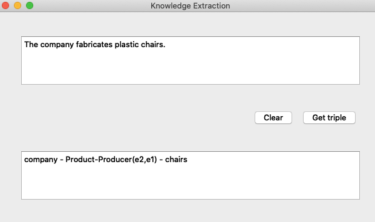

# 三元组抽取：SemEval2010关系抽取+NER

一个简单的三元组抽取小demo

## 运行环境

- python 3.x
- nltk
- sklearn 0.21.3

## 运行方式

```python
git clone https://github.com/Heatao/HEASTAO-RE.git
```

### 运行demo

```python
python KE_DEMO.py
```

### 用bert做分类

建议在colab运行ipynb

具体查看bert_ER中的readme

bert代码源自王树义老师的封装

## 实现过程

- 界面采用pyqt

- NER是调用的nltk

- 基本的关系分类是采用tfidf+svm

### 结果

- 用tfidf+svm的f1值约为0.42
- 用bert的f1约为0.84

## 结果图



#### bug

如果遇到模型不匹配的问题，可以重新训练tfidf_svm
